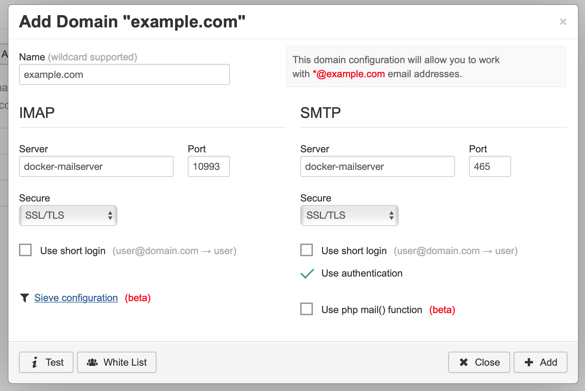

# docker-mailserver

## Architecture

There are several ways you might deploy docker-mailserver. The most common would be:

1. Within a cloud provider, utilizing a load balancer service from the cloud provider (i.e. GKE). This is an expensive option, since typically you'd pay for each individual port (25, 465, 993, etc) which gets load-balanced

2. Either within a cloud provider, or in a private Kubernetes cluster, behind a non-integrated load-balancer such as haproxy. An example deployment might be something like the https://www.funkypenguin.co.nz/project/a-simple-free-load-balancer-for-your-kubernetes-cluster/, or even a manually configured haproxy instance/pair.

## Requirements

1. You need helm, obviously. This is a helm chart ;)

2. You need to install cert-manager, and setup issuers (https://docs.cert-manager.io/en/latest/index.html). It's easy to install using helm (which you have anyway, right?). Cert-manager is what will request and renew SSL certificates required for docker-mailserver to work. The chart will assume that you've configured and tested certmanager.

Here are the TL;DR steps for installing cert-manager:

```
# Install the CustomResourceDefinition resources separately
kubectl apply -f https://raw.githubusercontent.com/jetstack/cert-manager/release-0.7/deploy/manifests/00-crds.yaml

# Create the namespace for cert-manager
kubectl create namespace cert-manager

# Label the cert-manager namespace to disable resource validation
kubectl label namespace cert-manager certmanager.k8s.io/disable-validation=true

# Add the Jetstack Helm repository
helm repo add jetstack https://charts.jetstack.io

# Update your local Helm chart repository cache
helm repo update

# Install the cert-manager Helm chart
helm install \
  --name cert-manager \
  --namespace cert-manager \
  --version v0.7.0 \
  jetstack/cert-manager
```


## Installation

```
    # Todo: Document any required values, if they exist.
    $ helm upgrade --install path/to/dockermailserver dockermailserver
```

## Operation

### Create / Update / Delete users

### Setup OpenDKIM

```
[funkypenguin:~/Documents/Personal/Projects/docker-mailserver/helm-chart] add-helm-chart 1 ± ../setup.sh config dkim
"docker inspect" requires at least 1 argument.
See 'docker inspect --help'.

Usage:  docker inspect [OPTIONS] NAME|ID [NAME|ID...]

Return low-level information on Docker objects
Creating DKIM private key /tmp/docker-mailserver/opendkim/keys/bob.com/mail.private
Creating DKIM KeyTable
Creating DKIM SigningTable
Creating DKIM private key /tmp/docker-mailserver/opendkim/keys/example.com/mail.private
Creating DKIM TrustedHosts
[funkypenguin:~/Documents/Personal/Projects/docker-mailserver/helm-chart] add-helm-chart* ±
```

### Setup RainLoop

If employing HAProxy with RainLoop, use port 10993 for your IMAPS server, as illustrated below:



## Configuration

All configuration values are documented in values.yaml. Check that for references, default values etc. To modify a
configuration value for a chart, you can either supply your own values.yaml overriding the default one in the repo:

```bash
$ helm upgrade --install path/to/dockermailserver dockermailserver --values path/to/custom/values/file.yaml
```

Or, you can override an individual configuration setting with `helm upgrade --set`

```bash
$ helm upgrade --install path/to/dockermailserver dockermailserver --set pod.dockermailserver.image="your/image:1.0.0"

## Usage

// Todo: Write up usage.
